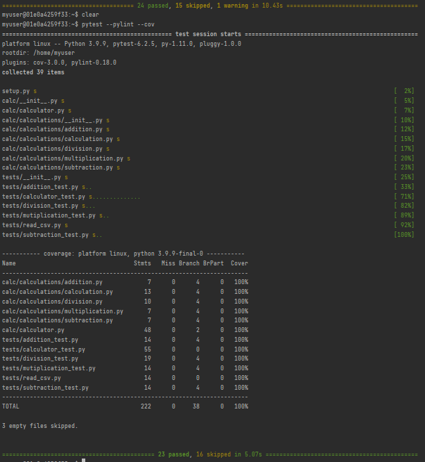

# Calculator Project

**This is the calculator program where the tests uses csv files to test programs.**

## Pytest using Pylint and Coverage
To run tests, Lint, and Coverage report use this command:
pytest  --pylint --cov
* pylintrc is the config for pylint
* .coveragerc is the config for coverage 
* setup.py is a config file for pytest
## Test Result
